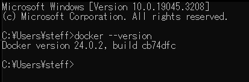

# Docker Assignment

## Brief Description
Docker is a widely used platform and tool that enables developers to create, deploy, and run applications in a containerized environment. Docker is an open-source containerization platform that allows developers to package applications and their dependencies into isolated containers. Containers are lightweight, portable, and self-sufficient units that include everything needed to run an application, such as the code, runtime, system libraries, and settings. 

#### Assignment Purpose:
To understand Docker concepts and able to containerize a Node.js application effectively.

### Getting Started :
#### Install Docker
1. Visit [Docker Website](https://www.docker.com/)
2. Download the installer based on your machine operating system.
3. After installing, possibly you are required to install WSL
   * If yes, you can go to command prompt or your machine terminal run: `wsl.exe --install` `or wsl.exe --update`
4. You can register and login your docker account.
5. Final step is to make sure your docker version or docker is properly installed on machine by checking it on command prompt or terminal `docker --version`
 

###

